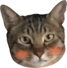

# Frontend_Lecture

# FE 프로젝트
https://kkb00714.github.io/Frontend_Lecture/

피그마 링크와 요구사항 명세를 참고하여 랜딩페이지를 만들어 보도록 합니다. 모바일 화면도 고려하여 과제를 수행해야 합니다.

## 3.1 피그마 링크

[https://www.figma.com/design/s9RCnA6dSi3QHHeMDFHKE6/EST-오르미(BE)_HTML%2FCSS%2FJS?node-id=104924-12&t=DkHqKMa1PBxYw4n3-0](https://www.figma.com/design/s9RCnA6dSi3QHHeMDFHKE6/EST-%EC%98%A4%EB%A5%B4%EB%AF%B8(BE)_HTML%2FCSS%2FJS?node-id=104924-12&t=DkHqKMa1PBxYw4n3-0)

## 3.2 요구사항 명세

1. 피그마를 참고하여 페이지 구현을 합니다.
2. 모바일 화면도 고려하여 페이지 구현을 합니다.
3. 스크롤시 헤더가 고정되게 합니다. (단, 처음에는 고정된 상태가 아닙니다.)
4. 스크롤 탑 버튼을 구현합니다. 
    1. 스크롤 탑 버튼은 스크롤시 나타납니다.
    2. 스크롤 탑 버튼은 푸터 아래로 내려가지 않습니다.
    3. 스크롤 탑 버튼을 누르면 스크롤이 최상단으로 올라갑니다. (단, 부드럽게 올라가야 합니다.)
5. 구독하기 모달창
    1. 이메일을 입력하고 `Subscribe` 버튼을 클릭하면 모달창이 나타납니다.
    2. 이메일 유효성 검사를 진행해야 합니다. (값이 들어가지 않거나 이메일 형식이 유효하지 않으면 alert 창으로 경고 문구가 떠야합니다.)
    3. 이메일이 잘 입력되었다면 모달창이 뜹니다. 이때 모달창의 `OK! I love HODU` 버튼을 클릭하면 form이 제출되고 모달창이 닫힙니다.

-------------

# 발표 자료

## 발표 목차
1. HTML
2. CSS
3. JS

### 주요 HTML 부분

    

        

            

                <h3>Subscribe to our Blog post</h3>
                
Lorem Ipsum is simply dummy text of the printing and typesetting industry.

                
Lorem Ipsum has been the industry's standard dummy text 

            

            

                
                <form id="subscribe-form" onsubmit="return validateEmail()" style="display: flex; align-items: center; width: 100%;">
                    <input id="email" type="email" class="floating-box-email" placeholder="Enter your e-mail address" required />
                    <button type="button" class="floating-box-submit" onclick="handleSubscribe()">Subscribe</button>
                </form>
            

        

        <!-- 구독하기 모달창 -->
        

            

                
                <h2>Thank you!</h2>
                
Lorem Ipsum is simply dummy text of the printing industry.

                <button id="modal-submit" class="modal-button">OK! I Love HODU</button>
            

        

        <!-- 탑 버튼 -->
        

            <button class="upbutton-center">
                
            </button>
        

    

### font-face 

    @font-face {
    font-family: 'Pretendard-Regular';
    src: url('https://fastly.jsdelivr.net/gh/Project-Noonnu/noonfonts_2107@1.1/Pretendard-Regular.woff') format('woff');
    font-weight: 400;
    font-style: normal;
    }

=> 피그마에서 명시되어 있던 기본적인 글꼴 설정 (Pretendard-Regular)

### body 부분

    body {
        font-family: "Pretendard-Regular";
        max-width: 1920px;
        margin: 0;
        padding: 0;
        display: flex;
        flex-direction: column;
        justify-content: center;
        align-items: center;
        text-align: center;
    }

### 섹션 별 CSS 요소 - header

    header {
        position: absolute;
        top: 0;
        left: 0;
        z-index: 1000;
        background-color: rgba(242, 233, 216, 1);
        width: 100%;
        height: 102px;
        display: flex;
        justify-content: center;
    }

### 섹션 별 CSS 요소 - First Page, Second Page, Third Page

    /* First Page Styles */
    .first-page {
        display: flex;
        justify-content: center;
        align-items: center;
        background-color: rgba(242, 233, 216, 1);
        width: 100vw;
        height: 900px;
        margin: 0 auto;
        padding: 0 160px;
        box-sizing: border-box;
        position: relative;
    }

    /* Second Page */
    .second-page {
        display: flex;
        flex-direction: column;
        justify-content: center;
        align-items: center;
        width: 100vw;
        margin: 0 auto;
        box-sizing: border-box;
    }

    .third-page {
        position: relative;
        text-align: left;
        display: flex;
        flex-direction: column;
        align-items: center;
        width: 100vw;
        margin: 0 auto;
        box-sizing: border-box;
        margin-bottom: 200px;
    }

    .floating-box {
        position: absolute;
        display: flex;
        justify-content: space-between;
        align-items: center;
        left: 50%;
        transform: translateX(-50%);
        width: 100%;
        max-width: 1280px;
        height: 200px;
        background-color: rgba(38, 49, 64, 1); 
        border-radius: 30px;
        z-index: 100;
        top: -100px;
        padding: 0 60px;
        box-sizing: border-box;
    }

    .modal {
        display: none;
        position: absolute;
        z-index: 200;
        width: 100%;
        max-width: 600px;
        height: 400px;
        background-image: url(./src/mbk.png);
        background-repeat: no-repeat;
        background-size: cover;
        align-items: center;
        left: 50%;
        transform: translate(-50%, -10%);
        top: -50%;
        border-radius: 30px;
        box-shadow: 10px 10px 30px 0px rgba(0, 0, 0, 0.5);
    }

### 주요 JS 부분

    // 스크롤 시 헤더 고정
    window.addEventListener('DOMContentLoaded', function() {
        const header = document.querySelector('header');

        window.addEventListener('scroll', function() {
            if (window.scrollY > 0) {
                header.style.position = 'fixed';
                header.style.top = '0';
            } else {
                header.style.position = 'absolute';
                header.style.top = '0';
            }
        });
    });

    // 구독 이메일 validation 검사
    function validateEmail() {
        const email = document.getElementById("email");
        const emailValue = email.value;
        const emailPattern = /^[^\s@]+@[^\s@]+\.[^\s@]+$/;

        if (!emailValue) {
            alert("이메일을 입력해주세요.");
            return false;
        }

        if (!emailPattern.test(emailValue)) {
            alert("유효한 이메일 주소를 입력해주세요.");
            return false;
        }

        return true;
    };

    // 구독 버튼 클릭 시 모달 열기
    function handleSubscribe() {
        if (validateEmail()) {
            openModal();
        }
    };

    // 모달 열기
    function openModal() {
        document.getElementById("modal").style.display = "block";
        document.body.style.overflow = "hidden";
    };

    // 모달 닫기 및 폼 제출
    document.getElementById("modal-submit").addEventListener("click", function () {
        document.getElementById("subscribe-form").submit();
        closeModal();
    });

    // 모달 닫기 함수
    function closeModal() {
        document.getElementById("modal").style.display = "none";
        document.body.style.overflow = "";
    };

    // 스크롤 이벤트 처리
    window.addEventListener('DOMContentLoaded', function() {
        const upButton = document.querySelector('.upbutton');
        const lastPicture = document.querySelector('.last-picture');
        const footer = this.document.querySelector('footer');

        // 스크롤이 100 이상일 때 버튼 노출
        window.addEventListener('scroll', function() {
            const footerPosition = footer.getBoundingClientRect().top;
            const windowHeight = window.innerHeight;

            if (window.scrollY > 100) {
                upButton.classList.add('show-upbutton');
            } else {
                upButton.classList.remove('show-upbutton');
            }

            if (footerPosition <= windowHeight) {
                upButton.classList.remove('fixed');
                upButton.classList.add('absolute');
            } else {
                upButton.classList.remove('absolute');
                upButton.classList.add('fixed');
            }
        });

        upButton.addEventListener('click', function() {
            window.scrollTo({ top: 0, behavior: 'smooth' });
        });
    });

    // 모바일 네비게이션 열기
    function toggleMenu() {
        const menu = document.getElementById('mobile-menu');
        menu.classList.toggle('open');

        const icon = document.getElementById('menu-icon');
        icon.classList.toggle('close-icon');
    };

    // 모바일 네비게이션 닫기
    function closeMenu() {
        const menu = document.getElementById('mobile-menu');
        menu.classList.remove('open');
    };

    // 뒤로가기 아이콘 클릭 시 닫기 함수 호출
    window.addEventListener('DOMContentLoaded', function() {
        const closeIcon = document.getElementById('menu-icon');

        closeIcon.addEventListener('click', function() {
            closeMenu();
        });
    });